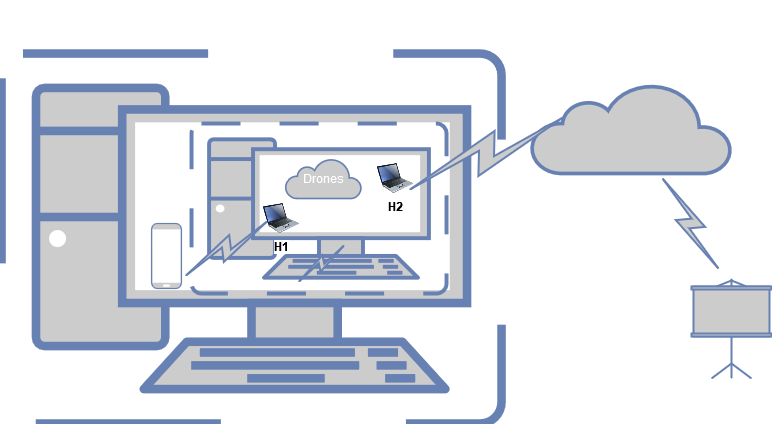

# Anti-Distress Messager

# 1. Project Description
The Project focuses on developing a system to support a Command and Control (C2) system to help rescue teams job. The scope covers the physical infrastructure and its integration with the apps. To simulate this scenario, minninet wifi will be used to emulate a drone infrastructure. Those drones will provide a p2p network to transmit information to a central dashboard.

# 2. Motivation
The natural disaster emergency team's operations need a way to control their actions. Command and Control (C2) system is very important in this context and is  *"recognized as a mean of mobilizing, organizing, and managing the various actors to integrate roles, rules, responsabilities, and authorities in disaster response tasks"*1. As is known, such situations are a time-sensitive matter. Therefore, C2 systems can upgrade the efficiency, giving real time information that is very important to save victim's life. So, this project aims to provide a C2 system to help emergency responders go faster and more correctly to where a disaster victim needs help.

# 3. How to Install and Run the Project
To install the project we have to emulate a mininet wifi network in a VM. As we can see in the next figure, the drones will be conect to host via virtual host H1 and with the ineternet by H2. In the VM host we have Mosquito, the project APP to provide the victms data.

# 4. Include Credits
Our Team:

| SR No | Name                                                                                                                                           | Contact                                                      |
| ----- | ------------------------------------------------------------------------------------------------------------------------------------------------- | ----------------------------------------------------------- |
| 1     | Adrián Aguilar Sánchez                                    | A01651592@tec.mx                   |
| 2     | María Fernanda Argueta Wolke                                           | A00830194@tec.mx                  |
| 3     | Román Mauricio Elías Valencia                                                   | A01656603@tec.mx                      |
| 4     | David González Alanís                                                             | A01661650@tec.mx                      |
| 5     | Sebastián Íñigo López                                                | A01661179@tec.mx                      |
| 6     | María Esther Ramírez Cedillo                                                    | A01656060@tec.mx                     |
| 7     | Fábio Antero de Pulpa Melo Júnior                     | fabio.junior@ga.ita.br                      |
| 8     | Marcelo Reis da Silva                                         | marcelo.silva.101270@ga.ita.br                      |
| 9     | Due Jie Wan                                         |due.wan@ga.ita.br                     |

# 5. Licence
This project is under the GPL license.

# 6. Deliverables
  Client and Edge Stage..........:      https://youtu.be/l0Mx4hqcWck
  Client and Edge Stage with MQTT:      https://www.youtube.com/watch?v=D801a-fiSbA

# 7. References

1. Escudeiro, Andreia, et al. "Command and control system management: a perspective of disaster response actors in Brazil." Production 32 (2022).

